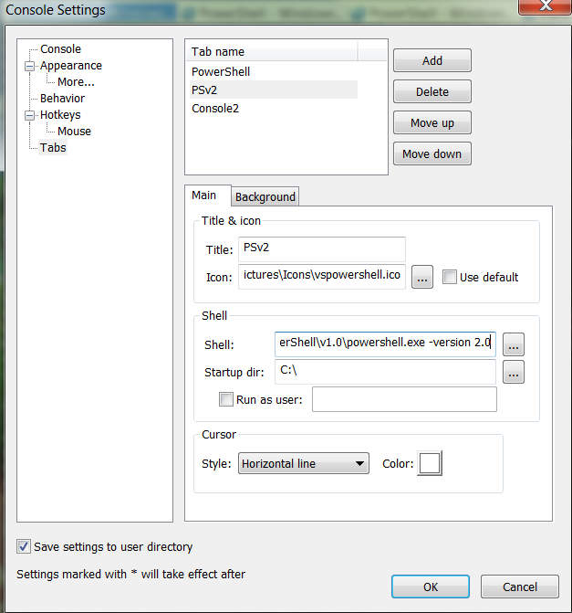

# Running PowerShell 2 scripts After Installing PowerShell 3

My employer has a lot of PowerShell v2 scripts in production, spread across a great many servers at a great many sites. It’s because I have to support these scripts in production that I have held off on updating myself to PowerShell v3. I finally got tired of holding myself back and took the plunge. I updated my PowerShell install, but was immediately hit with a wall of red text concerning an incompatibility in my install of PowerShell Community Extensions. No problem, I go and download the latest. Now I can run PowerShell, but I’m smacked in the face with problems from our deployment package scripts. What I really needed to be able to do right away was get back to a v2 compatible mode. Fortunately, that wasn’t too bad.

`PowerShell.exe –version 2.0`

That will start version 2.0 of PowerShell. As far as I can tell, this isn’t just some compatibility mode, but the real v2 environment (if you know otherwise, let me know in the comments). You can tell there’s a difference by checking the value of $PSVersonTable, or by the difference in behavior in Start-Process. Now I can start up in version 2 and run all of our production scripts in the same environment that (most of) our servers will have.

I’ve had to do this enough now that I just created a new tab type in Console2.



Now when I want to be 100% sure that I’m stuck in PowerShell v2 mode for dealing with production scripts requiring that environment, I can just start up this tab.  It’s clearly labeled via the title, and I selected a fairly irritating cursor style so that there’s never any question what mode I’m running.

All of this is great, except now I get a wall of red text because the new PSCX I just installed doesn’t work with PowerShell v2. Don’t worry, there’s actually a fairly simple solution to that. First, you’re going to want to go grab a version of PSCX that works with PowerShell v2. Install it to a sibling folder of your v3 PSCX install (I picked Modules\Pscx_21).

Most of the time, Import-Module wants the module name and the name of the folder in which it is stored to be the same. The way around this is to point Import-Module to the actual .psd1 file. So `Import-Module .\Modules\Pscx_21\Pscx.psd1` works just fine. Now a little bit of trickery with your `$profile` to figure out what version of PowerShell is being loaded, and to load the correct version of PSCX in response.

```powershell
if($PSVersionTable.PSVersion.Major –eq 2) {
    Import-Module .\Modules\Pscx_21\Pscx.psd1
}
else {
    Import-Module .\Modules\Pscx
}
```

Now you will be loading the correct version of PowerShell Community Extensions no matter which version of PowerShell you’re starting. Of course, there are still a few gotchas that we’ve bumped into in our upgrade. I’ll cover those in future posts. What about those of you reading this? Anything you want to warn other developers about before they upgrade to PowerShell version 3?