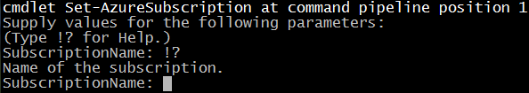

# Unhelpful PowerShell Azure Message

Even though my day job does not do much with Azure (right now), I thought I should spend some time becoming familiar with the PowerShell connections available to Azure. I’m hardly stretching the state of the art here, but I have had more than a couple of instances lately where standing up a quick website using Azure Websites was handy. So far, I have done this using WebMatrix. While WebMatrix is a nice tool for the quick stuff, I feel like it has isolated me from the real deployment work flow. So off to PowerShell I go!

Unfortunately, even early on I have found some things that rub me the wrong way. Take this example, when running the Set-AzureSubscription cmdlet.

That is a perfect example of a bad help message.
Me: “What does Subscription Name mean?”
System: “It’s the name of the subscription, dummy.”
